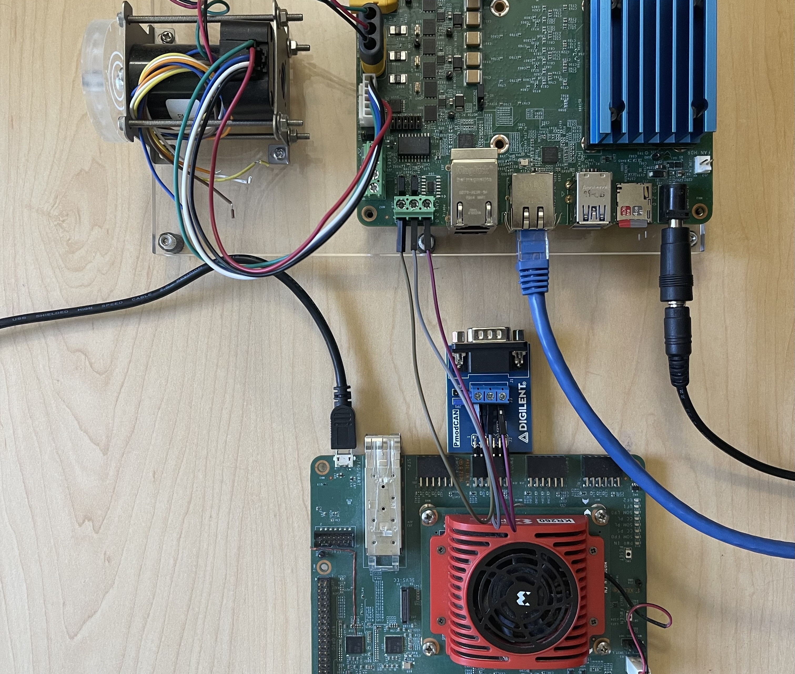

<table class="sphinxhide">
 <tr>
   <td align="center"><h1> Kria&trade; KD240 Drives Starter Kit <br>FOC Motor Control Application Tutorial</h1>
   </td>
 </tr>
 <tr>
 <td align="center"><h1>Setting up the Board and Application Deployment</h1>

 </td>
 </tr>
</table>

# Board Setup and Application Deployment

## Introduction

This document shows how to set up the board, and run the motor control application.

This guide is targeted for Ubuntu® 22.04 and the AMD 2023.1 toolchain.

## Prerequisite

### Hardware Requirements

* [KD240 Drives Starter Kit](https://www.xilinx.com/products/som/kria/kd240-drives-starter-kit.html)

* [KD240 Motor Accessory Kit](https://www.xilinx.com/products/som/kria/kd240-motor-accessory-pack.html)

* KD240 power supply and adapter (included with the KD240 Drives Starter Kit)
  * 12V AC adapter for the KD240 Starter Kit and 24V AC adapter for the Motor Accessory Kit

* USB-A to micro-B cable (included with the KD240 Drives Starter Kit)

* MicroSD card (32 GB card is included with the KD240 Drives Starter Kit)

* CAT6 Ethernet cable

* Host machine with display

* [One Wire Temperature Sensor](https://www.adafruit.com/product/381?gad_source=1&gclid=EAIaIQobChMI2IS22dqmhAMVIxWtBh1legB6EAQYASABEgKwIvD_BwE)

### Hardware Setup


* Connect the USB cable from the host machine to the J4 UART/JTAG interface on the board.

  

* Connect the Ethernet cable from J24 to your local network with DHCP enabled to install the Linux packages.

  

* Connect a 12V power supply to the J12 DC jack.

  

* Connect a 24V power supply to the J29 DC link connector.

  

* Connect the encoder header pins to the J42 QEI connector. Ensure J44 is in the "SE" selection.

  

* Connect the motor input to a J32 3-phase inverter connector.

  

* Connect the One Wire Temperature Sensor to J47 Temp Sensor connector. Red connects to 3-5V, Blue/Black
connects to ground and Yellow/White is Sense(data)

  

* Only for CANopen server interface: Connect PMOD-CAN module to PMOD3 on the
  KR260. Connect CAN cables from J18 on the KD240 to the PMOD-CAN module (CANL
  to CANL, CANH to CANH, GND to GND).

  

### Tested Artifacts

Testing was performed with the following artifacts:

#### KD240 platform Artifacts

| Component                      | Version                    |
|--------------------------------|----------------------------|
| Boot Firmware                  | K24-BootFW-01.01           |
| Linux Kernel                   | 5.15.0-1027-xilinx-zynqmp  |
| xlnx-firmware-kd240-motor-ctrl | 0.10.1-0xlnx1              |

To obtain the latest Linux image and boot firmware, refer to the [Kria Wiki](https://xilinx-wiki.atlassian.net/wiki/spaces/A/pages/1641152513/Kria+K26+SOM#Boot-Firmware-Updates).

#### Application Packages

| Package                        | Version      |
|--------------------------------|--------------|
| xlnx-app-kd240-foc-motor-ctrl  | 0.3.1-0xlnx5 |

### Initial Setup

1. Go through [Booting Kria Starter Kit Linux](https://xilinx.github.io/kria-apps-docs/kd240/linux_boot.html) to complete the minimum setup required to boot Linux before continuing with instructions on this page.

2. Get the latest motor control application and firmware package:

   * Download the firmware.
      * Search package feed for packages compatible with the KD240.

         ```bash
         ubuntu@kria:~$ sudo apt search xlnx-firmware-kd240
         Sorting... Done
         Full Text Search... Done
         xlnx-firmware-kd240-bist/jammy,now 0.10-0xlnx1 arm64 [installed]
         FPGA firmware for Xilinx boards - kd240 bist application
         xlnx-firmware-kd240-motor-ctrl-qei/jammy,now 0.10-0xlnx1 arm64 [installed]
         FPGA firmware for Xilinx boards - kd240 motor-ctrl-qei application
         ```

      * Install the firmware binaries.

         ```bash
         sudo apt install xlnx-firmware-kd240-motor-ctrl-qei
         ```

   * Install the motor control application.

      ```bash
      sudo apt install xlnx-app-kd240-foc-motor-ctrl
      ```

3. Install lm-sensors package for One Wire Temperature sensor

      ```bash
      sudo apt install lm-sensors
      ```

## Load the Firmware

* Show the list and status of available application firmware.

  After installing the firmware, execute xmutil listapps to verify that it is captured under the listapps function and to have dfx-mgrd rescan and register all accelerators in the firmware directory tree.

  ```bash
  ubuntu@kria:~$ sudo xmutil listapps
         Accelerator          Accel_type                 Base           Base_type      #slots(PL+AIE)    Active_slot

    kd240-motor-ctrl-qei       XRT_FLAT         kd240-motor-ctrl-qei     XRT_FLAT            (0+0)           -1
  ```

* Load the desired application firmware.

  When there is already another accelerator/firmware loaded, unload it first, then load the kd240-foc-motor-ctrl firmware.

  ```bash
  sudo xmutil unloadapp
  sudo xmutil loadapp kd240-motor-ctrl-qei
  ```

## Control Interfaces

This application provides two interfaces to control the motor. The dashboard
application allows the user to control the motor and view live plots via a
web-based dashboard running on the KD240. The CANopen application allows the
user to start a CANopen server on the KD240 and control the motor via service
calls from another device over the CAN bus. The steps for both control
interfaces are described in more detail below.

Note: Only one interface can used at a time.

## Run the Motor Control Dashboard Application

### On the KD240

* Run the bokeh server:

  ```bash
  # Run the application to launch bokeh server for the dashboard
  export PATH=${PATH}:/opt/xilinx/xlnx-app-kd240-foc-motor-ctrl/bin
  start_motor_dashboard
  # Enter the sudo password if required and note the ip address of the board
  ```

  Sample screenshot of the terminal on launching the motor dashboard.

  

* Change Motor Configurations:

  By default the motor configuration parameters are provided by `/etc/motor-control/config` file.
  The configuration file stores various parameters required for motor control. These parameters include general
  motor settings, voltage and mode configurations, PWM settings, gain parameters, and other calibration settings.
  This allows for flexible and precise configuration of different motors by simply adjusting these parameters in
  the config file. One can point to a different configuration file by passing additional argument to the bokeh server
  allowing to use different configuration files for different motors.

  To run the Bokeh server with a specific configuration file, use the following command structure:
    ```bash
    sudo bokeh serve --show --allow-websocket-origin=<ip>:5006 mc_bokeh.py --args </path/to/config/file>
    ```
  Replace <ip> with board `ip` and `<path/to/config/file>` with the actual path to the desired configuration file.

  > Note: If no path is specified, the default configuration file [anaheim.config](https://github.com/Xilinx/foc-motor-ctrl/blob/main/lib/configs/anaheim.config) will be used. Inline comments in the config file explains each parameter.

## On the Host PC

* Open &lt;ip&gt;:5006 in a web browser.

  >**NOTE:** Once the server is running, it retains its settings no matter how many times the browser is closed, opened, or refreshed.

* The system is set to OFF mode/state on starting the dashboard, observe the blue LED DS10 is off.
* If the unit is plugged into a network with DHCP, an IP will be assigned automatically. If not on a network, then configure a static IP. For help on setting up static IP, see [Setting up a private network](https://github.com/Xilinx/vck190-base-trd/blob/2022.1/docs/source/run/run-dashboard.rst#setting-up-a-private-network).

>**NOTE:** The open-loop mode of motor operation is a test mode intended for users with motor control knowledge and experience. Incorrect configurations of values of Vd and Vq can cause the motor to spin at speeds higher than its rating and potentially cause excessive motor heating. Use caution when using the open-loop mode.

### Dashboard Features

* The Mode drop-down is used to select the control system mode of operation.
* The Sample Size text box is used to indicate how many samples are collected and plotted on the graphs for each type of data. The samples are collected at 100 microsecond intervals. The maximum number of samples is limited to 3000 due to dashboard performance limitations. For a large number of samples, there might be a small delay before a dashboard command takes effect.
* The Refresh Interval text box is used to indicate how often the dashboard plots will refresh. A minimum refresh interval will be enforced based on the current sample size (a larger sample size requires a larger refresh interval).
* The gain text boxes are used to adjust the proportional and integral gains of the corresponding control loop.
* The Speed Setpoint text box is used to set the speed setpoint when running the motor in speed mode. The valid range of speed setpoints is -10000 to 10000 rpm.
* The Torque Setpoint text box is used to set the torque setpoint when running the motor in torque mode. The valid range of torque setpoints is -2.5 to 2.5 amps.
* The Open Loop - Vd text box is used to set the  direct voltage (Vd). The valid range for Vd is -24 to 24 volts.
  >**NOTE:** Normally this should be set to ~0V.
* The Open Loop - Vq text box is used to set the quadrature voltage (Vq). The valid range for Vq is -24 to 24 volts.
* The Fault Status indicators show if any faults have occured. When a critical fault occurs, the corresponding indicator will turn red. For a warning level faults, the corresponding indicator will turn yellow.
* The Clear Faults button is used to clear all faults and put the system into Off mode.
* The Electrical Data plot shows the currents and voltages for Phase A, B, and C. The voltage lines are hidden by default. The visibility of each current and voltage line can be toggled by clicking the legend labels. The current axis is shown on the left if any current lines are visible, and the voltage axis is shown on the right is any voltage lines are visible.
* The Mechanical Data plot shows the speed and position of the motor. The visibility of each line can be toggled by clicking on the legend labels. The speed axis is shown on the left is speed is visible and the position axis is shown on the right if position is visible.
* The Live Analysis plot shows the data that is selected for each axis using the buttons on the right.

When the dashboard is first launched, the system will be in Off mode, and the dashboard will look similar to the following image. Observe that the electrical readings are near zero.


To run the application in Speed mode, select **Speed** from the Mode drop-down, and use the Speed Setpoint text box to enter a speed setpoint. The following image shows the motor running in speed mode with a speed setpoint of 2000 rpm and the load disk that is included in the Motor Accessory Kit.


To run the application in Torque mode, select **Torque** from the Mode drop-down and use the Torque Setpoint text box to enter a torque setpoint. The following image shows the motor running in torque mode with a torque setpoint of 1 amp and the load disk that is included in the Motor Accessory Kit.


To run the application in Open Loop mode, select **Open Loop** from the Mode drop-down, and use the Vd/Vq text boxes to set Vd/Vq. The following image shows the motor running in open loop mode with Vd set to 0, Vq set to 4 volts, and the load disk that is included in the Motor Accessory Kit.


The following images show what the dashboard looks like when a larger load is applied to the motor. As the load on the motor increases, the currents will increase and the I_alpha/I_beta circle will expand.


## Run the Motor Control ROS2 CANopen Application

### Test CAN Communication

* On the KR260, go through [Booting Kria Starter Kit Linux](https://xilinx.github.io/kria-apps-docs/kr260/build/html/docs/kria_starterkit_linux_boot.html) to complete the minimum setup required to boot Linux before continuing with instructions on this page.

* Install and load firmware on KR260. The kr260-tsn-rs485pmod firmware is used
  to enable to PMOD-CAN interface on KR260.

  ```bash
  sudo apt install kr260-tsn-rs485pmod
  sudo xmutil unloadapp
  sudo xmutil loadapp kr260-tsn-rs485pmod
  ```

* Set up the CAN interface on both the KR260 and KD240.

  ```bash
  sudo ip link set can0 up type can bitrate 1000000
  sudo ip link set can0 txqueuelen 1000
  sudo ip link set can0 up
  ```

* Install can-utils on both the KR260 and KD240.

  ```bash
  sudo apt install -y can-utils
  ```

* On one board, run candump.

  ```bash
  candump can0
  ```

* On the other board, use cansend to send test data. You should see this data
  show up on the board running candump.

  ```bash
  sudo cansend can0 123#1122334455667788
  ```

### On the KD240

* Run the CANopen application.

  ```bash
  export PATH=${PATH}:/opt/xilinx/xlnx-app-kd240-foc-motor-ctrl/bin
  start_motor_server
  ```

### On the KR260 (master)

* Download the docker image on the KR260.

  ```bash
  docker pull xilinx/foc-motor-ctrl-ros2-canopen-host:latest
  ```

* You can find the images installed with the following command:

  ```bash
  docker images
  ```

* Launch the docker container on the KR260.

  ```bash
  docker run \
      --env=DISPLAY \
      --env=XDG_SESSION_TYPE \
      --net=host \
      --privileged \
      --volume=/home/ubuntu/.Xauthority:/root/.Xauthority:rw \
      -v /tmp:/tmp \
      -v /dev:/dev \
      -v /sys:/sys \
      -v /etc/vart.conf:/etc/vart.conf \
      -v /lib/firmware/xilinx:/lib/firmware/xilinx \
      -v /run:/run \
      -it foc-motor-ctrl-ros2-canopen-host:latest bash
  ```

* Make sure you are inside the docker container and source the ROS setup files.

  ```bash
  source /opt/ros/humble/setup.bash
  source /root/ros_ws/install/setup.bash
  ```

* Start the launch file.

  ```bash
  ros2 launch foc_motor kd240.launch.py
  ```

* Open a new terminal, find the docker container id, and launch another
  session connected to the same container.

  ```bash
  docker ps       # Copy container_id from output of this command
  docker exec -it <container_id> bash
  ```

* In the new docker session, source the ROS setup files.

  ```bash
  source /opt/ros/humble/setup.bash
  source /root/ros_ws/install/setup.bash
  ```

* Check the available services and their types.

  ```bash
  ros2 service list -t
  ```

  The output should look similar to this:
  ```bash
  ubuntu@KR260:~$ ros2 service list -t
  /device_container_node/change_state [lifecycle_msgs/srv/ChangeState]
  /device_container_node/describe_parameters [rcl_interfaces/srv/DescribeParameters]
  /device_container_node/get_parameter_types [rcl_interfaces/srv/GetParameterTypes]
  /device_container_node/get_parameters [rcl_interfaces/srv/GetParameters]
  /device_container_node/init_driver [canopen_interfaces/srv/CONode]
  /device_container_node/list_parameters [rcl_interfaces/srv/ListParameters]
  /device_container_node/set_parameters [rcl_interfaces/srv/SetParameters]
  /device_container_node/set_parameters_atomically [rcl_interfaces/srv/SetParametersAtomically]
  /kd240/cyclic_position_mode [std_srvs/srv/Trigger]
  /kd240/cyclic_velocity_mode [std_srvs/srv/Trigger]
  /kd240/describe_parameters [rcl_interfaces/srv/DescribeParameters]
  /kd240/get_parameter_types [rcl_interfaces/srv/GetParameterTypes]
  /kd240/get_parameters [rcl_interfaces/srv/GetParameters]
  /kd240/halt [std_srvs/srv/Trigger]
  /kd240/init [std_srvs/srv/Trigger]
  /kd240/interpolated_position_mode [std_srvs/srv/Trigger]
  /kd240/list_parameters [rcl_interfaces/srv/ListParameters]
  /kd240/nmt_reset_node [std_srvs/srv/Trigger]
  /kd240/nmt_start_node [std_srvs/srv/Trigger]
  /kd240/position_mode [std_srvs/srv/Trigger]
  /kd240/recover [std_srvs/srv/Trigger]
  /kd240/sdo_read [canopen_interfaces/srv/CORead]
  /kd240/sdo_write [canopen_interfaces/srv/COWrite]
  /kd240/set_parameters [rcl_interfaces/srv/SetParameters]
  /kd240/set_parameters_atomically [rcl_interfaces/srv/SetParametersAtomically]
  /kd240/target [canopen_interfaces/srv/COTargetDouble]
  /kd240/torque_mode [std_srvs/srv/Trigger]
  /kd240/velocity_mode [std_srvs/srv/Trigger]
  /launch_ros_33646/describe_parameters [rcl_interfaces/srv/DescribeParameters]
  /launch_ros_33646/get_parameter_types [rcl_interfaces/srv/GetParameterTypes]
  /launch_ros_33646/get_parameters [rcl_interfaces/srv/GetParameters]
  /launch_ros_33646/list_parameters [rcl_interfaces/srv/ListParameters]
  /launch_ros_33646/set_parameters [rcl_interfaces/srv/SetParameters]
  /launch_ros_33646/set_parameters_atomically [rcl_interfaces/srv/SetParametersAtomically]
  /master/describe_parameters [rcl_interfaces/srv/DescribeParameters]
  /master/get_parameter_types [rcl_interfaces/srv/GetParameterTypes]
  /master/get_parameters [rcl_interfaces/srv/GetParameters]
  /master/list_parameters [rcl_interfaces/srv/ListParameters]
  /master/sdo_read [canopen_interfaces/srv/COReadID]
  /master/sdo_write [canopen_interfaces/srv/COWriteID]
  /master/set_parameters [rcl_interfaces/srv/SetParameters]
  /master/set_parameters_atomically [rcl_interfaces/srv/SetParametersAtomically]
  ```

* To view an interface definition, use:
  ```bash
  ros2 interface show <type>
  ```

  For example, to view the interface definition for the canopen_interfaces/srv/COTargetDouble
  type which is used for the /kd240/target service, run the command below.
  This will print the input (target) and output (success).
  ```bash
  ubuntu@KR260:~$ ros2 interface show canopen_interfaces/srv/COTargetDouble
  float64 target
  ---
  bool success
  ```

* Use service calls to control the motor.

  The services available and their descriptions can be found in the
  [Cia402 Driver documentation](https://ros-industrial.github.io/ros2_canopen/manual/humble/user-guide/cia402-driver.html).

  Reset:
  ```bash
  ros2 service call /kd240/nmt_reset_node std_srvs/srv/Trigger
  ```

  Init:
  ```bash
  ros2 service call /kd240/init std_srvs/srv/Trigger
  ```

  Change to velocity mode:
  ```bash
  ros2 service call /kd240/velocity_mode std_srvs/srv/Trigger
  ```

  Change target speed:
  ```bash
  ros2 service call /kd240/target canopen_interfaces/srv/COTargetDouble "target: 800"
  ```

  Halt:
  ```bash
  ros2 service call /kd240/halt std_srvs/srv/Trigger
  ```

## Run One Wire Temperature Sensor Demo

### Tested Artifacts

Testing was performed with the following artifacts:

#### KD240 platform Artifacts

| Component                      | Version              |
|--------------------------------|----------------------|
| Boot Firmware                  | K24-BootFW-01.00.bin |
| Linux Kernel                   | 5.15.0-1030          |
| xlnx-firmware-kd240-motor-ctrl | 0.12-0xlnx1          |

* In this demo, the lm-sensors utility probes the One Wire Temperature sensor, reads and displays the captured temperature value on  the serial terminal.

* Ensure to load the motor-ctrl-qei firmware before running the demo

  ```bash
  sudo xmutil unloadapp
  sudo xmutil loadapp kd240-motor-ctrl-qei
  ```

* Run a sanity check to verify if the 1-wire slave sensor has been probed successfully.

  ```bash
  ubuntu@kria:~$ sudo dmesg | grep 'w1'
  [  247.023403] w1_master_driver w1_bus_master1: Attaching one wire slave 28.00000f0559bc crc dc
  ```

* You can also check if the slave entry is added under `/sys/bus/w1/devices` and if master bus also registers this slave.

  ```bash
  ubuntu@kria:/sys/bus/w1/devices$ ls
  28-00000f0559bc  w1_bus_master1

  ubuntu@kria:/sys/bus/w1/devices$ cat 28-00000f0559bc/name
  28-00000f0559bc
  ubuntu@kria:/sys/bus/w1/devices$ ls 28-00000f0559bc
  alarms     eeprom_cmd  hwmon  power       temperature
  conv_time  ext_power   id     resolution  uevent
  driver     features    name   subsystem   w1_slave

  ubuntu@kria:/sys/bus/w1/devices/w1_bus_master1$ cat w1_master_slave_count
  1
  ubuntu@kria:/sys/bus/w1/devices/w1_bus_master1$ cat w1_master_slaves
  28-00000f0559bc
  ```

* You can also read the temperature through the filesystem

  ```bash
  ubuntu@kria:~$ ls /sys/class/hwmon/
  hwmon0  hwmon1  hwmon2  hwmon3

  ubuntu@kria:~$ cat /sys/class/hwmon/hwmon3/name
  w1_slave_temp

  ubuntu@kria:~$ cat /sys/class/hwmon/hwmon3/temp1_input
  20618
  ```

* The sensor read through the filesystem provides temperature in millidegrees Celsius

* The `lm_sensors` utility's `sensors` command gathers information from the kernel interfaces provided by `hwmon` subsystem, aggregates this raw data,
applies scaling and calibration and presents it in a human-readable format.

* Run the 1-wire demo to measure temperature.

  ```bash
  # Output should be the following

  ubuntu@kria:~$ sensors
  ina260_u3-isa-0000
  Adapter: ISA adapter
  in1:           5.06 V
  power1:        2.46 W
  curr1:       487.00 mA

  ams-isa-0000
  Adapter: ISA adapter
  in1:           1.21 V
  in2:           0.00 V
  in3:         720.00 mV
  in4:         848.00 mV
  in5:           1.79 V
  in6:           1.79 V
  in7:         852.00 mV
  in8:         848.00 mV
  in9:         849.00 mV
  in10:          1.80 V
  in11:          1.09 V
  in12:          1.79 V
  in13:          1.79 V
  in14:          1.79 V
  in15:          1.79 V
  in16:        850.00 mV
  in17:          1.80 V
  in18:        598.00 mV
  in19:        718.00 mV
  in20:          1.80 V
  in21:          1.25 V
  in22:          0.00 V
  in23:        846.00 mV
  in24:        846.00 mV
  in25:        852.00 mV
  in26:          1.80 V
  in27:        601.00 mV
  temp1:        +25.1°C
  temp2:        +26.5°C
  temp3:        +27.1°C

  w1_slave_temp-virtual-0
  Adapter: Virtual device
  temp1:        +20.6°C
  ```

* The output will have multiple sensors and `w1_slave_temp-virtual` is the desired One Wire Temperature Sensor value that is connected to KD240.

## Next Steps

* Go back to the [KD240 FOC Motor Control Application Start Page](../foc_motor_control_landing)

<!---

Licensed under the Apache License, Version 2.0 (the "License"); you may not use
this file except in compliance with the License.

You may obtain a copy of the License at http://www.apache.org/licenses/LICENSE-2.0.

Unless required by applicable law or agreed to in writing, software distributed under the License is distributed on an "AS IS" BASIS, WITHOUT WARRANTIES OR CONDITIONS OF ANY KIND, either express or implied. See the License for the specific language governing permissions and limitations under the License.

-->

<p class="sphinxhide" align="center">Copyright&copy; 2023 Advanced Micro Devices, Inc</p>
