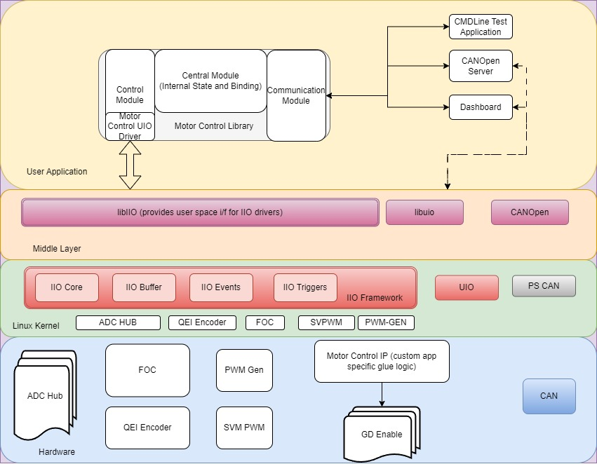
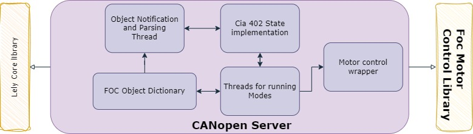
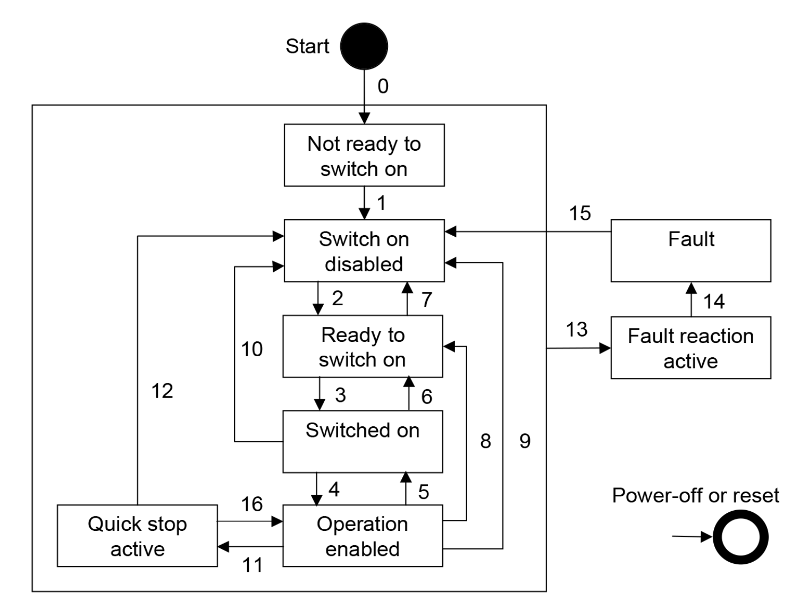
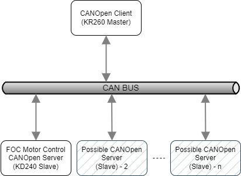
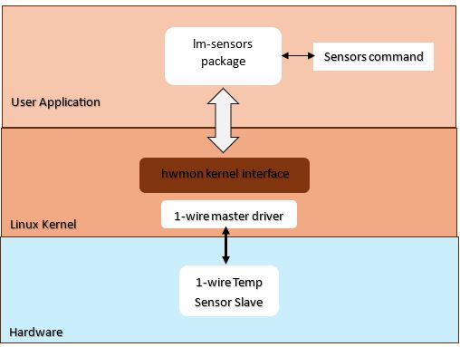

<table class="sphinxhide">
 <tr>
   <td align="center"><h1> Kria&trade; KD240 Drive Starter Kit</h1>
   </td>
 </tr>
 <tr>
 <td align="center"><h1> Software Architecture </h1>

 </td>
 </tr>
</table>

# Software Architecture of the Platform

## Introduction

This section describes software components involved in the design and their relation with each other. The application requires a hardware platform as described in [Hardware Architecture of the Platform](./hw_description.md) for the stack explained in this section to work.

The software stack here provides a comprehensive library that can be interfaced using various user interfaces and efficiently drive the motor through the Kria Drive SOM board.

The following diagram illustrates the top-level architecture and arrangement of various software components:



- Kernel: Ubuntu Linux kernel
  - `hwmon` : Hardware Monitoring Kernel Framework
  - Drivers:
    - `xilinx_adc_hub`: IIO driver for analog-to-digital converter (ADC) HUB
    - `hls_qei_axi`: IIO driver for the QEI sensor
    - `hsl_foc_periodic`: IIO driver for the sensor based field oriented controller
    - `hls_pwm_gen`: IIO driver for PWM GEN
    - `hsl_svpwm_duty`: IIO driver for SVPWM
    - `amd_axi_w1` : AMD 1Wire programmable logic bus driver
- Middleware
  - IIO Framework and libiio library
  - Generic UIO framework
  - CANopen library
- Application and library
  - Motor Control Library (includes UIO driver for the custom Motor Control IP)
  - Bokeh dashboard
  - CANopen Server
  - lm-sensors : Linux Monitoring Sensors utility package

## Kernel Drivers

All the kernel drivers developed for the platform hardware are Industial I/O (IIO) based and adhere to the IIO kernel framework. The IIO subsystem covers many sensor and ADC devices in the industry. It provides the following features to fetch and control various parameters:

- Divide the stream and type of data into logical channels.
- Each channel can have specific attributes along with device attributes to fine-tune the behavior.
- Efficient data collection using buffers to get deterministic data with timestamps and sync with other channels.
- Interrupt handling to provide user side event handling.

The following drivers are added to support this app:

- ADC Hub (`xilinx_adc_hub`): Provides an interface to monitor current, voltage, and related faults that occur during the operation of the motor.
- QEI Encoder (`hls_qei_axi`): External encoder to monitor the real-time speed and position of the motor.
- FOC (`hsl_foc_periodic`): Field oriented controller driver to support various operational modes and state of the motor.
- PWM_GEN (`hls_pwm_gen`): PWM_GEN provides PWM signal generation for motor control.
- SVPWM_GEN (`hsl_svpwm_duty`): SVPWM provides space vector PWM to calcualte phase ratio for the motor.

There is also custom Motor control IP, which is responsible for the design specific glue logic and driving the motor's Gate Driver. The driver for this IP is a UIO based and the device will instantiate the UIO device for this IP. The userspace driver for this is implemented inside the motor control library in the control block.

> Note: For CANopen implementation CAN driver is used from the default networking stack and is not detailed here.

### Device and Channel Attributes

As explained in the [next section](#userspace-access-to-iio-drivers), the attributes exposed by each drivers can be accessed through sysfs interface or through libraries like libIIO.

Most of the attribute names are self-explanatory. If a channel attribute is named `input`, it indicates that the device requires raw data for processing, and the final processed data can be read from the `input` channel attribute. If the `input` channel attribute is not present, the raw data itself represents the final value from the device.

A couple of common device attributes accross IIO drivers in this application are:

- `sample_interval_us`: This parameter represents the time period in microseconds. It determines the rate at which data is sampled and stored into the buffer. Only channel data is captured within the buffer.
- `ap_ctrl`: This attribute conforms to the standard AMD HLS interface for IP, enabling the initiation of its operation.

The device attributes applies to entire device for all the channels. The channel attributes are per channel configurations or data. Here are some of the attributes exposed by above drivers:

#### Xilinx ADC Hub Channels

List of available channels for the device `xilinx_adc_hub`.

```bash
ubuntu@kria:# iio_attr -c xilinx_adc_hub
dev 'xilinx_adc_hub', channel 'voltage0' (input, index: 0, format: le:S32/32>>0), found 9 channel-specific attributes
dev 'xilinx_adc_hub', channel 'current1' (input, index: 1, format: le:S32/32>>0), found 9 channel-specific attributes
dev 'xilinx_adc_hub', channel 'voltage2' (input, index: 2, format: le:S32/32>>0), found 9 channel-specific attributes
dev 'xilinx_adc_hub', channel 'current3' (input, index: 3, format: le:S32/32>>0), found 9 channel-specific attributes
dev 'xilinx_adc_hub', channel 'voltage4' (input, index: 4, format: le:S32/32>>0), found 9 channel-specific attributes
dev 'xilinx_adc_hub', channel 'current5' (input, index: 5, format: le:S32/32>>0), found 9 channel-specific attributes
dev 'xilinx_adc_hub', channel 'voltage6' (input, index: 6, format: le:U32/32>>0), found 9 channel-specific attributes
dev 'xilinx_adc_hub', channel 'current7' (input, index: 7, format: le:U32/32>>0), found 9 channel-specific attributes
dev 'xilinx_adc_hub', channel 'timestamp' (input, index: 16, format: le:S64/64>>0), found 0 channel-specific attributes
```

Individual Channel Properties for Voltage0 in `xilinx_adc_hub`:

```bash
ubuntu@kria:# iio_attr -c xilinx_adc_hub voltage0
dev 'xilinx_adc_hub', channel 'voltage0' (input), attr 'calibrate',
dev 'xilinx_adc_hub', channel 'voltage0' (input), attr 'fault_clear',
dev 'xilinx_adc_hub', channel 'voltage0' (input), attr 'input', value '0.865447998'
dev 'xilinx_adc_hub', channel 'voltage0' (input), attr 'offset', value '0.000000000'
dev 'xilinx_adc_hub', channel 'voltage0' (input), attr 'over_range_fault_status', value '0'
dev 'xilinx_adc_hub', channel 'voltage0' (input), attr 'raw', value '47'
dev 'xilinx_adc_hub', channel 'voltage0' (input), attr 'scale', value '0.018814086'
dev 'xilinx_adc_hub', channel 'voltage0' (input), attr 'set_filter_tap', value '4'
dev 'xilinx_adc_hub', channel 'voltage0' (input), attr 'under_range_fault_status', value '0'
```

- `calibrate`: One-time calibration at the very start to offset any residual value in the system.
- `fault_clear`: Clears all faults on the channel.
- `input`: Final voltage value read by the ADC in volts (raw * scale factor).
- `offset`: Automatically populated after calibration.
- `over_range_fault_status`: Status indicating if an over-range fault occurred (0 - for no fault).
- `raw`: The ADC raw value.
- `scale`: The scaling factor.
- `set_filter_tap`: Number of filter taps.
- `under_range_fault_status`: Status indicating if an under-range fault occurred (0 for no fault).

The attributes for the currentX channel would be similar to `voltage0`, but the readings are in amperes (amps).

#### HLS PWM Generator Channels

List of available channels for the device `hls_pwm_gen`.

```bash
ubuntu@kria:# iio_attr -c hls_pwm_gen
dev 'hls_pwm_gen', channel 'voltage0', id 'Va_duty_ratio' (input, index: 0, format: le:U32/32>>0), found 3 channel-specific attributes
dev 'hls_pwm_gen', channel 'voltage1', id 'Vb_duty_ratio' (input, index: 1, format: le:U32/32>>0), found 3 channel-specific attributes
dev 'hls_pwm_gen', channel 'voltage2', id 'Vc_duty_ratio' (input, index: 2, format: le:U32/32>>0), found 3 channel-specific attributes
dev 'hls_pwm_gen', channel 'timestamp' (input, index: 3, format: le:S64/64>>0), found 0 channel-specific attributes
```

Individual Channel Properties for Va_duty_ratio in the HLS PWM Generator:

```bash
ubuntu@kria:# iio_attr -c hls_pwm_gen voltage0
dev 'hls_pwm_gen', channel 'voltage0' (input), id 'Va_duty_ratio', attr 'label', value 'Va_duty_ratio'
dev 'hls_pwm_gen', channel 'voltage0' (input), id 'Va_duty_ratio', attr 'raw', value '0.000000000'
dev 'hls_pwm_gen', channel 'voltage0' (input), id 'Va_duty_ratio', attr 'scale', value '1'
```

- `label`: The label of the channel is 'Va_duty_ratio'.
- `raw`: The raw value for this channel is '0.000000000', and in this case, it represents the final reading for the channel.
- `scale`: The scaling factor for this channel is '1'.

The attributes are similar to the other channels from the PWM-GEN driver.

#### HLS SVPWM Duty Channels

List of available channels for the device `hls_svpwm_duty`.

```bash
ubuntu@kria:# iio_attr -c hls_svpwm_duty
dev 'hls_svpwm_duty', channel 'voltage0', id 'Va_cmd' (input, index: 0, format: le:U32/32>>0), found 3 channel-specific attributes
dev 'hls_svpwm_duty', channel 'voltage1', id 'Vb_cmd' (input, index: 1, format: le:U32/32>>0), found 3 channel-specific attributes
dev 'hls_svpwm_duty', channel 'voltage2', id 'Vc_cmd' (input, index: 2, format: le:U32/32>>0), found 3 channel-specific attributes
dev 'hls_svpwm_duty', channel 'timestamp' (input, index: 3, format: le:S64/64>>0), found 0 channel-specific attributes
```

Individual Channel Properties for `Va_cmd` in HLS SVPWM Duty:

```bash
ubuntu@kria:# iio_attr -c hls_svpwm_duty voltage0
dev 'hls_svpwm_duty', channel 'voltage0' (input), id 'Va_cmd', attr 'label', value 'Va_cmd'
dev 'hls_svpwm_duty', channel 'voltage0' (input), id 'Va_cmd', attr 'raw', value '0.000000000'
dev 'hls_svpwm_duty', channel 'voltage0' (input), id 'Va_cmd', attr 'scale', value '1'
```

- `label`: The label of the channel is `Va_cmd`.
- `raw`: The raw value for this channel is `0.000000000`, and in this case, it represents the final reading for the channel.
- `scale`: The scaling factor for this channel is `1`.

The attributes are similar to the other channels from the SVPWM driver.

#### QEI Channels

List of available channels for the device `hls_qei_axi`.

```bash
ubuntu@kria:# iio_attr -c hls_qei_axi
dev 'hls_qei_axi', channel 'rot0', id 'rpm' (input, index: 0, format: le:U32/32>>0), found 3 channel-specific attributes
dev 'hls_qei_axi', channel 'rot1', id 'theta_degree' (input, index: 1, format: le:U32/32>>0), found 3 channel-specific attributes
dev 'hls_qei_axi', channel 'timestamp' (input, index: 2, format: le:S64/64>>0), found 0 channel-specific attributes
```

Individual Channel Properties for RPM in QEI:

```bash
ubuntu@kria:# iio_attr -c hls_qei_axi rot0
dev 'hls_qei_axi', channel 'rot0' (input), id 'rpm', attr 'label', value 'rpm'
dev 'hls_qei_axi', channel 'rot0' (input), id 'rpm', attr 'raw', value '0'
dev 'hls_qei_axi', channel 'rot0' (input), id 'rpm', attr 'scale', value '1'
```

- `label`: The label of the channel is 'rpm'.
- `raw`: The raw value for this channel is '0', and in this case, it represents the final reading for the channel.
- `scale`: The scaling factor for this channel is '1'.

The attributes are similar to the other channels from the QEI driver.

#### FOC Channels

List of available channels for the device `hls_foc_periodic`.

```bash
ubuntu@kria:# iio_attr -c  hls_foc_periodic
dev 'hls_foc_periodic', channel 'current0', id 'Id' (input, index: 0, format: le:U32/32>>0), found 3 channel-specific attributes
dev 'hls_foc_periodic', channel 'current1', id 'Iq' (input, index: 1, format: le:U32/32>>0), found 3 channel-specific attributes
dev 'hls_foc_periodic', channel 'current2', id 'I_alpha' (input, index: 2, format: le:U32/32>>0), found 3 channel-specific attributes
dev 'hls_foc_periodic', channel 'current3', id 'I_beta' (input, index: 3, format: le:U32/32>>0), found 3 channel-specific attributes
dev 'hls_foc_periodic', channel 'current4', id 'I_homopolar' (input, index: 4, format: le:U32/32>>0), found 3 channel-specific attributes
dev 'hls_foc_periodic', channel 'rot5', id 'speed_pi_out' (input, index: 5, format: le:U32/32>>0), found 3 channel-specific attributes
dev 'hls_foc_periodic', channel 'rot6', id 'torque_pi_out' (input, index: 6, format: le:U32/32>>0), found 3 channel-specific attributes
dev 'hls_foc_periodic', channel 'intensity7', id 'flux' (input, index: 7, format: le:U32/32>>0), found 3 channel-specific attributes
dev 'hls_foc_periodic', channel 'rot8', id 'speed' (input, index: 8, format: le:U32/32>>0), found 3 channel-specific attributes
dev 'hls_foc_periodic', channel 'angl9' (input, index: 9, format: le:U32/32>>0), found 2 channel-specific attributes
dev 'hls_foc_periodic', channel 'timestamp' (input, index: 10, format: le:S64/64>>0), found 0 channel-specific attributes
```

Individual Channel Properties for current0 in FOC:

```bash
ubuntu@kria:~$ iio_attr -c hls_foc_periodic current0
dev 'hls_foc_periodic', channel 'current0' (input), id 'Id', attr 'label', value 'Id'
dev 'hls_foc_periodic', channel 'current0' (input), id 'Id', attr 'raw', value '0.000000000'
dev 'hls_foc_periodic', channel 'current0' (input), id 'Id', attr 'scale', value '1'
```

- `label`: The label of the channel is 'Id'.
- `raw`: The raw value for this channel is '0.000000000', and in this case, it represents the final reading for the channel.
- `scale`: The scaling factor for this channel is '1'.

The attributes are similar to the other channels from the FOC driver.

For detailed information on other device attributes, consult the [hardware documentation](./hw_description.md).

For more details of IIO subsystem, refer to [Analog Devices Wiki](https://wiki.analog.com/software/linux/docs/iio/iio).

For more details on kernel drivers for IIO, refer to [Kernel Documentation](https://static.lwn.net/kerneldoc/driver-api/iio/core.html).

## Middleware

### Userspace Access to IIO Drivers

The driver exposes the IIO devices through the sysfs interface. The drivers can be accessed from the path `/sys/bus/iio/devices/iio\:deviceX`, where `X` is the numeric enumeration of the IIO device.

libIIO is the userspace library to easily access the kernel IIO subsystem. It also provides various methods and command line interfaces, packaged in libiio-utils, to access the IIO devices. There are other Python wrappers around this library, but the motor control library uses a native C/C++ library.

For example, to list all the available IIO devices:

```
ubuntu@kria:~$ iio_attr -c
IIO context has 7 devices:
        iio:device0, ams: found 30 channels
        iio:device1, ina260-u14: found 6 channels
        iio:device2, hls_foc_periodic: found 11 channels
        iio:device3, hls_qei_axi: found 3 channels
        iio:device4, xilinx_adc_hub: found 9 channels
        iio:device5, hls_svpwm_duty: found 4 channels
        iio:device6, hls_pwm_gen: found 4 channels
```

For more details, refer to the [libIIO Documentation](https://analogdevicesinc.github.io/libiio/v0.23/index.html).

### Userspace Access to UIO

The custom motor control IP is accessed from the motor control library using the UIO interface. A device tree node with compatible string as `generic-uio` is added to connect this hardware to the UIO subsystem.

The device is now accessible in the userspace through the `/dev/uioX` device. Information about the device is obtained by scanning `/sys/class/uio/uioX`, where `X` is the UIO device id automatically assigned by the kernel.

For more information on the UIO interface, refer to the kernel [documentation](https://www.kernel.org/doc/html/v4.18/driver-api/uio-howto.html).

### CANopen Library

The CANopen server implementation for the drive kit is based on [Lely CANopen library stack](https://opensource.lely.com/canopen/) for the communication layer.

The Lely Core CANopen library is an open-source, feature-rich, and industrial-quality CANopen implementation for both masters and slaves. It is designed to be a passive library, relying on the user to send and receive CAN frames and update the clock. The interface between the CANopen stack and the CAN bus is provided by the CAN network object from the CAN library (liblely-can).

*The library is divided into several components:*

- liblely-co: A CANopen implementation for both masters and slaves.
- liblely-coapp: A C++ CANopen application library that provides a high-level application interface for liblely-co.
- liblely-io2: An asynchronous I/O library that provides support for timers, signal handlers, and CAN devices.

## Application and Library

The motor control library is a C++ library that provides APIs for the front end application to control and fetch motor parameters. It also has a pybind11 wrapper to support the library APIs through python front end.

The front end GUI included with this application is based on a python bokeh server, which can be accessed in a web browser in the network.

The CANopen server (slave wrapper) included with this application is implemented to access the motor control library (C++) over the CAN network using CANopen CiA 402 profile.

### Motor Control Library

The library can be divided into four blocks:

- Communication
- State Management and Coordination
- Event/Fault Management
- Control


#### Communication

The external user interfacing exposes the supported APIs through the C++ shared library and Python module.

The library allows the user application to fetch following values:

- Speed
- Position
- Current (Phase A, Phase B, Phase C, DC Link)
- Voltage (Phase A, Phase B, Phase C, DC Link)
- Fault status
  - Over current for A, B, C, DC
  - Over and under voltage for DCLink
  - RMS power fault
  - Phase imbalance fault
- Intermediate FOC calculations (example: iq, id, i_alpha, etc)

The library allows the user application to set following motor controls:

- Clear faults
- Speed
- Torque
- Open loop parameters (vq and vd)
- Gain P/I gains (for current, speed and flux controller)

For details list of APIs, refer to the [motor-control.hpp](https://github.com/xilinx/foc-motor-ctrl/blob/main/lib/include/motor-control/motor-control.hpp) file.

Python binding for the application is provided using the pybind11 library.

#### State Management and Coordination

This is the central part of the library, which receives and processes all the request from the communication block and is responsible for:

- Executing the initialization sequence for the motor.
- Maintaining the current state of the platform and handling the state transitions.
- Splitting, merging, and coordinating the request with various handlers in the control block.

#### Event/Fault Management

The Event Manager is responsible for configuring and monitoring events/faults from various hardware blocks. This block is aware of event capabilities of various control blocks and configures the events accordingly.

It caches the event status in realtime and returns that to user when requested. The event is monitored in a separate thread which waits on epoll events for the registered events. Optionally, it also provides callback function registration in case additional action is expected when a realtime event occurs.

#### Control

This block is responsible for hardware access. There are interface classes which implement common interfaces for all the IIO based control handlers and all the UIO based control handlers. It also provides abstraction for the sensor interface to support more than one sensor (only one used at a given time).

The following various handlers are for controlling the respective hardware:

- FOC: For controlling and fetching data from the FOC hardware through the libiio framework.
- ADCHub: For controlling and fetching data from the ADCHub hardware through the libiio framework.
- Sensor: Abstraction for controlling and fetching data from the sensor hardware through the libiio framework (QEI in this case).
- PWM_Gen: For controlling the PWM_GEN hardware through the libiio framework.
- SVPWM: For controlling the SVPWM hardware through the libiio framework.
- MC_UIO: For controlling custom Motor Control IP hardware through the UIO framework.
- SW_AvgPower: Software based average power calculator to generate fault and control gate driver through MC_UIO.

#### Additional Threads

The following additional threads are implemented in the library:

- Speed Ramp: When a new *speed* set point is set, the speed is ramped up or down in the FOC control handler using the constant ramp rate defined in `default_config.h`.
- Torque Ramp: When new *torque* set point is set, the speed is ramped up or down in the FOC control handler using the constant ramp rate defined in `default_config.h`.
- Event Monitor: The event manager waits on any event using epoll_wait in its own thread.

### Bokeh Server (GUI)

A python based bokeh server is implemented to provide a GUI interface to the application. It imports the motor control python library. The plot updates are handled by an update function which is called at the interval specified in the Refresh Interval text box. For each update, the function requests the number of samples specified in the Sample Size text box and update the plots with new data.

For more details on the GUI usage, refer the [Application Deployment](./app_deployment.md) page for the details on the components and its usage.

### CANopen Overview

The CANopen server is an another interface provided for this motor control application.
It is based on CANopen communication protocol. This section provides a top level overview
of the CANopen protocol & operations. Detail CANopen protocol and specifications can be found on
[CAN in Automation (CiA) website](https://www.can-cia.org/) and various other online resources.

CANopen is a robust communication protocol widely used in industrial automation for managing
networked devices, such as sensors and actuators. It is based on the Controller Area Network (CAN)
and provides a standardized way to enable communication and control among devices.

#### CANopen Protocol Stack

Conceptually, the CANopen protocol stack is structured into several layers, each responsible for different aspects of communication:

1. **Bus Layer**:
   - Physical: Defines the physical and electrical characteristics of the network, such as connectors, wiring, and signaling levels.
   - Data link: Managed by the CAN protocol, this layer handles error detection, message arbitration, and framing. It ensures that messages are transmitted without collisions and that errors are detected and handled.

2. **Communication Layer**:
   - Network: Responsible for managing the states of the devices in the network. It includes functionalities such as starting, stopping, and resetting devices. Each device can be in one of several states: Initialization, Pre-operational, Operational, or Stopped.
   - Transport/Session:
     - **Process Data Objects (PDO)**: Used for real-time data exchange. PDOs are transmitted cyclically or on change of state and are suitable for high-speed data transfer.
     - **Service Data Objects (SDO)**: Used for configuration and diagnostics. SDOs allow access to any object in the object dictionary and are used for less time-critical communication.
     - **Emergency (EMCY) Objects**: Used to signal error conditions. EMCY messages are transmitted when a device detects an error, allowing for immediate error handling.
     - **Synchronization (SYNC) Objects**: Used to synchronize actions across the network. A SYNC message can trigger the simultaneous operation of multiple devices.
     - **Time Stamp (TIME) Objects**: Used to provide a common time reference for devices in the network.

3. **Application Layer**:
   - This top layer interacts with the user application and provides services like reading sensor data, controlling actuators, or configuring device parameters.

#### CAN Frame and COB-ID

At the core of CANopen communication is the CAN frame which are transmitted on the CAN bus and the concept of Communication Object Identifier(COB-ID).

**CAN Frame:**

- A CAN frame consists of several fields that define the structure of a message. These fields include:

  | Field Name | Description | Bits |
  |---|---|---|
  | Start of Frame (SOF) | Single dominant bit (0) | 1 |
  | Identifier (ID) | Unique message identifier & Priority | 11 |
  | Control  | Type of frame(RTR) and Length of Data (DLC) | 5 |
  | Data Field | Actual data content | 0-8 bytes |
  | CRC (Cyclic Redundancy Check) | Error detection code | 15 |
  | ACK (Acknowledge) | Reception confirmation (dominant 0 by successful receivers) | 1 |
  | End of Frame (EOF) | Five consecutive recessive bits (1) | 5 |

**COB-ID**:

- The COB-ID is a unique identifier for each CANopen message, determining its priority and the type of communication. It consists of an 11-bit or 29-bit identifier (depending on the CAN protocol version) and is crucial for the arbitration process on the CAN bus.
- The COB-ID is used to differentiate various types of CANopen messages, such as NMT commands, PDOs, SDOs, and EMCYs.
- It is split in two parts: By default, the first 4 bits equal a function code and the next 7 bits contain the node ID.
- Here is the list of common COB-IDs

  | Communication Object | Function Code(4 bit) | Node Ids (7bit) | COB-IDS (Hex) | Total Objects |
  |----------------------|----------------------|-----------------|---------------|---------------|
  | NMT                  | 0000                 | 0000000         | 0             | 1             |
  | SYNC                 | 0001                 | 0000000         | 80            | 1             |
  | EMCY                 | 0001                 | 0000001-1111111 | 81 - FF       | 127           |
  | TIME                 | 0010                 | 0000000         | 100           | 1             |
  | Transmit PDO 1       | 0011                 | 0000001-1111111 | 181 - 1FF     | 127           |
  | Receive PDO 1        | 0100                 | 0000001-1111111 | 201 - 27F     | 127           |
  | Transmit PDO 2       | 0101                 | 0000001-1111111 | 281 - 2FF     | 127           |
  | Receive PDO 2        | 0110                 | 0000001-1111111 | 301 - 37F     | 127           |
  | Transmit PDO 3       | 0111                 | 0000001-1111111 | 381 - 3FF     | 127           |
  | Receive PDO 3        | 1000                 | 0000001-1111111 | 401 - 47F     | 127           |
  | Transmit PDO 4       | 1001                 | 0000001-1111111 | 481 - 4FF     | 127           |
  | Receive PDO 4        | 1010                 | 0000001-1111111 | 501 - 57F     | 127           |
  | Transmit SDO         | 1011                 | 0000001-1111111 | 581 - 5FF     | 127           |
  | Receive  SDO         | 1100                 | 0000001-1111111 | 601 - 67F     | 127           |
  | Heartbeat            | 1110                 | 0000001-1111111 | 701 - 77F     | 127           |

#### CANopen Object Dictionary

The heart of the CANopen protocol is the object dictionary, which is a standardized collection of all parameters and variables that can be accessed via CANopen. The object dictionary is organized in a hierarchical structure with each object identified by a unique 16-bit index. Objects include:

- **Communication Objects**: Parameters related to CANopen communication (e.g., COB IDs, transmission types).
- **Manufacturer-Specific Objects**: Custom parameters defined by the device manufacturer.
- **Standardized Device Profile Objects**: Parameters defined by device profiles such as CiA 402 for motion control.

#### Key Operations

1. **Initialization**:
   - Devices on the network initialize and configure their communication parameters based on the object dictionary.

2. **Network Management (NMT)**:
   - Devices transition between different states (e.g., Pre-operational, Operational) based on NMT commands.

3. **PDO Communication**:
   - Devices exchange real-time data using PDOs. For instance, a motor controller might receive speed commands and send back actual speed values using PDOs.

4. **SDO Communication**:
   - Devices perform configuration and diagnostics using SDOs. This includes reading and writing to the object dictionary.

5. **Emergency Messaging**:
   - Devices signal error conditions using EMCY messages, enabling immediate error handling.

6. **Synchronization**:
   - Devices synchronize their actions using SYNC messages, ensuring coordinated operations across the network.

7. **Time Stamping**:
   - Devices use TIME objects to maintain a consistent time reference, essential for time-sensitive applications.

### CANopen server

The CANopen server is designed to provide a robust interface that allows users to control and monitor motor operations over the CAN bus, leveraging the CiA 402 profile. This server facilitates seamless integration with motor control features, enabling commands such as start, stop, change mode, set speed, set torque, and retrieve motor position and speed.

The CANopen server is built on top of the Lely core library, which provides a comprehensive implementation of the CiA 301 standard. The server implements the CiA 402 profile, focusing on two primary modes of operation: Profiled Velocity and Profiled Torque. The target speed or torque can be set using respective object.

The server architecture can be divided into the following key components:

1. **CANopen Object Dictionary**:
   - The heart of the CANopen protocol, the object dictionary, contains all the parameters accessible via the CAN bus. For the CiA 402 profile, this includes objects related to motor control, such as operation modes, control commands, status indicators, and parameters for velocity and torque control.

2. **Motor Control Library Integration**:
   - The server interfaces with an underlying motor control C++ library to execute various motor control commands. This integration ensures that all CANopen commands translate into appropriate actions on the motor, providing a seamless control experience.

3. **CANopen Protocol Layers**:
   - **CiA 301 (CANopen Communication Profile)**: Managed by the Lely core library, this layer handles the general CANopen communication, including network management (NMT), process data objects (PDO), service data objects (SDO), and more.
   - **CiA 402 (CANopen Device Profile for Drives and Motion Control)**: Implemented in the application wrapper, this layer defines the specific commands and parameters for motor control, such as operation modes, control word, status word, and various motor-specific settings.

]

#### Operational Overview

The motor control drive device (KD240) is controlled primarily by the use of the objects **Control Word** and **Target Values**, with fault and status feedback provided via the **Status Word** object. The mode of the operation is controlled by **Modes of Operation** Object.

The PDS FSA state machine controls the sequencing of power to the drive, and access to drive motion. It also provides the ability to react to faults and to disable the drive if so needed.

The various configuration registers are normally configured using SDO operations. The status and command word operations are often set and read using PDO communications, but can also be managed using SDO operations. PDO operation can “be in the background”, but are not confirmed, and can also use up significant amounts of bus time if there are many units all reporting their positions continuously while moving. The SDO method allows control of bus activity as the vast majority of packets are the SDO commands and their responses.

The default the slave node id of the KD240 is `4`. It can be changed from during the application launch with argument as described in deployment section. The supported bitrates for the CAN bus are:

- 800 kbps
- 500 kbps
- 250 kbps
- 125 kbps
- 50 kbps
- 20 kbps

#### System State Machine

Object **6040h** (Control Word)  is used to request state transitions while Object 6041h (**Status Word**) reflects the current state of the State Machine. The below diagram reprents various state tranistions. The boxed names represent States, while the numbered arrows represent Transitions. In each case, the state reflected by Object 6041h is updated when the transition has been completed. Fault Reaction Active is the exception in that the fault is immediately reported when the fault is detected, while the fault reaction is still underway; when the reaction is completed, the state then automatically transitions to Fault.



The Foc Motor control drive undergoes the state through the C++ library, when in either of following states:

- *Switched on*
- *Operation enabled*
- *Quick stop active*

Other states transitioned from master using the control words are tracked in the server but will not directly
change the hardware state.


The **oms** bit is depended on the state of operation.

Depending on the current state, the below table shows command coding for various transition through the control word:

| Command                       | Bit 7 | Bit 3 | Bit 2 | Bit 1 | Bit 0 | Transitions |
| :-                            | :---: | :---: | :---: | :---: | :---: |  :---:      |
| Shutdown                      | 0     | X     | 1     | 1     | 0     | 2,6,8      |
| Switch on                     | 0     | 0     | 1     | 1     | 1     | 3           |
| Switch on + enable operation  | 0     | 1     | 1     | 1     | 1     | 3 + 4       |
| Disable voltage               | 0     | X     | X     | 0     | X     | 7,9,10,12   |
| Quick stop                    | 0     | X     | 0     | 1     | X     | 7,10,11     |
| Disable operation             | 0     | 0     | 1     | 1     | 1     | 5           |
| Enable operation              | 0     | 1     | 1     | 1     | 1     | 4,16        |
| Fault reset                   | R-edge| X     | X     | X     | X     | 15          |

The State of device can be queried by the object **4041h** (status word). The below table reflects the current state.

|Statusword            | PDS FSA state          |
|----------------------|------------------------|
| xxxx xxxx x0xx 0000b | Not ready to switch on |
| xxxx xxxx x1xx 0000b | Switch on disabled     |
| xxxx xxxx x01x 0001b | Ready to switch on     |
| xxxx xxxx x01x 0011b | Switched on            |
| xxxx xxxx x01x 0111b | Operation enabled      |
| xxxx xxxx x00x 0111b | Quick stop active      |
| xxxx xxxx x0xx 1111b | Fault reaction act     |
| xxxx xxxx x0xx 1000b | Fault                  |

#### Modes of Operation

The power drive system's behavior depends on the activated mode of operation. The mode of operation can be changed and controlled by **6060h** (Modes of Operation) Object. The control word dictates the actual state change as described before.

The control device writes to the modes of operation object in order to select the operation
mode. The drive device provides the modes of operation display object to indicate the actual
activated operation mode. controlword, statusword, and set-points are used mode-specific.
This implies the responsibility of the control device to avoid inconsistencies and erroneous
behavior. The switching between the modes of operation implies no automatic reconfiguration
of COBs for real-time data transmission.

This server supports following modes of operations (value of 6040h object in parentheses):

##### Profile Velocity

- Value for 6060h = 0x3
- Mode specific `Bit 8` of the control word represents Halt bit

  | Bit | Value | Definition                                              |
  |-----|-------|---------------------------------------------------------|
  | 8   | 0     | The motion shall be executed or continued               |
  | 8   | 1     | Axis shall be stopped according to the halt option code |

- Mode specific `Bit 10`, `Bit 12` and `Bit 13` of the status word represents

  | Bit | Value | Definition                                                                                                 |
  |-----|-------|------------------------------------------------------------------------------------------------------------|
  | 10  | 0     | Halt (Bit 8 of controlword) = 0 : Target not reached<br>Halt (Bit 8 of controlword) = 1 : Axis decelerates |
  | 10  | 1     | Halt (bit 8 in controlword) = 0: Target reached<br>Halt (bit 8 in controlword) = 1: Velocity of axis is 0  |
  | 12  | 0     | Speed is not equal to 0                                                                                    |
  | 12  | 1     | Speed is equal to 0                                                                                        |
  | 13  | 0     | Maximum slippage not reached                                                                               |
  | 13  | 1     | Maximum slippage reached                                                                                   |

##### Profile Torque

- Value for 6060h = 0x4
- Mode specific `Bit 8` of the control word represents Halt bit

  | Bit | Value | Definition                                              |
  |-----|-------|---------------------------------------------------------|
  | 8   | 0     | The motion shall be executed or continued               |
  | 8   | 1     | Axis shall be stopped according to the halt option code |

- Mode specific `Bit 10`, `Bit 12` and `Bit 13` of the status word represents

  | Bit | Value | Definition                                                                                                 |
  |-----|-------|------------------------------------------------------------------------------------------------------------|
  | 10  | 0     | Halt (Bit 8 of controlword) = 0 : Target not reached<br>Halt (Bit 8 of controlword) = 1 : Axis decelerates |
  | 10  | 1     | Halt (bit 8 in controlword) = 0: Target reached<br>Halt (bit 8 in controlword) = 1: Velocity of axis is 0  |
  | 12  | -     | Reserved                                                                                                   |
  | 12  | -     | Reserved                                                                                                   |
  | 13  | -     | Reserved                                                                                                   |
  | 13  | -     | Reserved                                                                                                   |


#### Object Dictionary Details

The Object Dictionary is defined in the Electronic Data Sheet (EDS), which lists all supported objects, along with any sub-objects. The full object dictionary can be found in eds (electronic data sheet) file available on the github [here](https://github.com/xilinx/foc-motor-ctrl/blob/main/apps/foc-mc.eds).

Following are the list of objects implemented for this server:

- **CiA 301 Device & Communication Objects**

  | Index  | Sub  |   Description                        | Access Type | PDO Mapped |
  |--------|------|--------------------------------------|-------------|------------|
  | 1000   | 0    | Device Type                          | Constant    |            |
  | 1001   | 0    | Error Register                       | RO          | YES        |
  | 1005   | 0    | COB-ID SYNC Message                  | RW          |            |
  | 1006   | 0    | Communication cycle period           | RW          |            |
  | 1007   | 0    | SYNC Window lenght                   | RW          |            |
  | 1008   | 0    | Manufacture Device Name              | Constant    |            |
  | 1009   | 0    | Manufacture Hw Ver                   | Constant    |            |
  | 100A   | 0    | Manufacture Hw Ver                   | Constant    |            |
  | 1005   | 0    | COB-ID SYNC Message                  | RW          |            |
  | 1012   | 0    | COB-ID time stamp object             | RW          |            |
  | 1014   | 0    | COB-ID EMCY                          | RW          |            |
  | 1015   | 0    | Inhibit time EMCY                    | RW          |            |
  | 1016   | 0-1  | Consumer heartbeat time              | -           |            |
  | 1017   | 0    | Producer heartbeat time              | RW          |            |
  | 1018   | 0-4  | Indentiy                             | -           |            |
  | 1019   | 0    | Synchronous counter overflow value   | RW          |            |
  | 1200   | 0-2  | SDO Server Parameter                 | -           |            |
  | 1400   | 0-5  | RPDO Comunication Parameters-1       | -           |            |
  | 1401   | 0-5  | RPDO Comunication Parameters-2       | -           |            |
  | 1402   | 0-5  | RPDO Comunication Parameters-3       | -           |            |
  | 1403   | 0-5  | RPDO Comunication Parameters-4       | -           |            |
  | 1600   | 0-1  | RPDO Mapping Parameters-1            | -           |            |
  | 1601   | 0-2  | RPDO Mapping Parameters-2            | -           |            |
  | 1602   | 0-2  | RPDO Mapping Parameters-3            | -           |            |
  | 1603   | 0-2  | RPDO Mapping Parameters-4            | -           |            |
  | 1800   | 0-6  | TPDO Comunication Parameters-1       | -           |            |
  | 1801   | 0-6  | TPDO Comunication Parameters-2       | -           |            |
  | 1802   | 0-6  | TPDO Comunication Parameters-3       | -           |            |
  | 1803   | 0-6  | TPDO Comunication Parameters-4       | -           |            |
  | 1A00   | 0-1  | TPDO Mapping Parameters-1            | -           |            |
  | 1A01   | 0-2  | TPDO Mapping Parameters-2            | -           |            |
  | 1A02   | 0-2  | TPDO Mapping Parameters-3            | -           |            |
  | 1A03   | 0-2  | TPDO Mapping Parameters-4            | -           |            |

- **Cia 402 Application Profile Objects**

  | Index  | Sub  |   Description                        | Access Type | PDO Mapped |
  |--------|------|--------------------------------------|-------------|------------|
  | 603F   | 0    |   Error Code                         | RO          |            |
  | 6040   | 0    |   Control Word                       | RW          | YES        |
  | 6041   | 0    |   Status Word                        | RO          | YES        |
  | 605A   | 0    |   Quick Stop                         | RW          |            |
  | 605B   | 0    |   Shutdown                           | RO          |            |
  | 605D   | 0    |   Halt                               | RW          |            |
  | 6060   | 0    |   Modes of Operation                 | RW          | YES        |
  | 6061   | 0    |   Modes of Operation display         | RO          | YES        |
  | 6064   | 0    |   Position Actual Value              | RO          | YES        |
  | 606C   | 0    |   Velocity Actual Value              | RO          | YES        |
  | 6071   | 0    |   Target Torque                      | RW          | YES        |
  | 6077   | 0    |   Torque Actual Value                | RO          | YES        |
  | 60FF   | 0    |   Target Velocity                    | RW          | YES        |
  | 6502   | 0    |   Supported Drive Modes              | RO          |            |

Detailed configuration and values of objects are available [here](canopen_obj_dic.md).

#### Using CANopen Server

The CANopen server can be utilized by any CiA 402 master on the CAN bus, providing a flexible and standardized interface for motor control. One of the possible usage is demonstrated in the deployment section, showing how a ROS2 based CANopen master running on KR260 can access the CANopen Server over the CAN bus.



##### ROS2 CANopen Mater

The example CANopen master used in the deployment section is based on [ROS2 CANopen Stack](https://ros-industrial.github.io/ros2_canopen/manual/humble/). This stack provides:

- **Easy YAML based bus configuration**: In this file you define the nodes that are connected to the bus by specifying their node id, the corresponding EDS file.
- **Service based operation**: The stack can be operated using standard ROS2 nodes. The lifecycle and CANopen state can be controlled using the Services of ROS2 nodes based on the driver selected in the YAML file.
- **ROS2 control based operation**: **canopen_ros2_control/CIA402System** interface is provided to control CANopen device over CANopen CiA 402 profile.

As ROS2 control integration is provided by ROS2 CANopen stack, it is easy to just define a hardware interface to use KD240 in the Robot system as a joint.

Example implementation of the ROS2 CANopen master that is used for deployment on KR260 is available [here](https://github.com/xilinx/foc-motor-ctrl/blob/main/test/ros2_canopen).

## One Wire

In addition to above motor control application, this platform also provides One Wire interface. The One Wire protocol is a communication protocol that allows for the transfer of data and power over a single wire.

This application makes use of the One Wire Temperature sensor which is a digital thermometer that uses the 1-wire protocol to communicate with a host device.

It measures temperature and converts it into digital signal, which can be read by microcontrollers and other devices.

The following diagram illustrates the top-level architecture and arrangement of various software components:



- Kernel: Ubuntu Linux kernel
  - `hwmon` : Hardware Monitoring Kernel Framework
  - Drivers:
    - `amd_axi_w1` : AMD 1Wire programmable logic bus driver
- Application
  - `lm-sensors` : Linux Monitoring Sensors utility package

### Kernel Driver

The driver developed for the platform provides support to the AMD 1-Wire programmable logic IP block and guarantees protocol
timing for driving off-board devices such as thermal sensors, proms, etc using the 1wire protocol.

The 1-Wire master driver in the kernel controls the 1-wire bus and provides the fundamental operations for communication, such as
sending and receiving bits, handling resets and presence pulses

The driver registers and manages the discovery and attachment of slave devices.

Workflow for 1-wire Slave connection:

- Initialization : The bus master driver initializes and registers with the 1-wire core.
- Detection: The bus master scans the bus for connected devices, identifying each by its unique address and adds an entry 28-XXXXXXXXXXXX in the `/sys/bus/w1/devices`.
- Binding : The 1-wire core matches detected devices with the appropriate slave.
- Communication : Slave uses the bus master operations to interact with the devices.

The Linux kernel includes hardware monitoring(hwmon) modules that interact with the sensor chips.

The driver exposes the sensor data to user space via the sysfs filesystem, located at /sys/class/hwmon/hwmonX, where `X` is the
number corresponding to the detected chips.

For integration of 1-wire sensor with the `hwmon` framework, a symbolic link in the `/sys/class/hwmon` directory is created pointing to
the one wire sensor. This is automatically managed by the 1-wire driver.

For example:

- To list all the `hwmon` interfaces:
  ```
  ubuntu@kria:~$ ls /sys/class/hwmon/
  hwmon0  hwmon1  hwmon2
  ```
- Load the motor-ctrl-qei firmware which loads the one wire kernel module. Assuming 1-wire Sensor is connected to KD240
- After firmware load a new `hwmon3` directory will appear which indicates successful recognition of 1-wire sensor.
- To read the temperature via hwmon, you can read the `temp1_input` file within the `hwmon3` directory.
- This provides temperature in millidegrees Celsius.

### Application

lm_sensors (Linux monitoring sensors) is a free and open-source application that provides tools and drivers for monitoring temperatures,
voltage, and fans. `sensors` is an application or primary command that is used to read and display sensor data.

This `sensors` command gathers information from the kernel interfaces provided by `hwmon` subsystem, aggregates this raw data, applies scaling
and calibration and presents it in a human-readable format.

## Next Steps

- [Application Deployment](./app_deployment.md)
- Go back to the [KD240 FOC Motor Control Landing Page](../foc_motor_control_landing)

